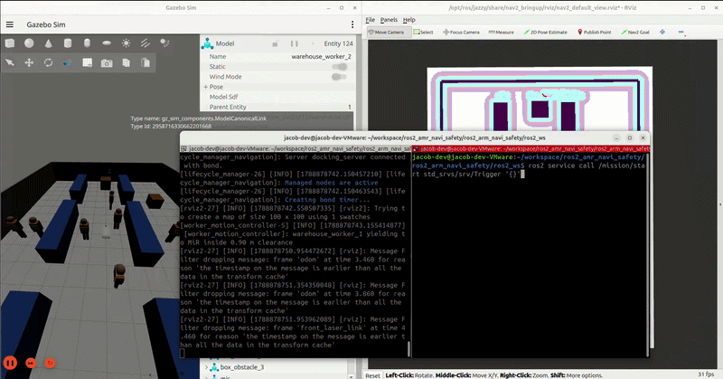

# ROS 2 AMR Navigation Safety Simulation

Gazebo Sim 환경의 MiR100에 ROS 2 Jazzy와 Nav2를 연결해, 이동 인원(장애물)을 감지하고 안전하게 정지·재출발하는 AMR 내비게이션 시뮬레이션입니다.



## 주요 기능

- MiR100 모델, Gazebo Sim 물리 충돌, 2D LiDAR, Nav2 경로 계획·추종을 통합했습니다.
- 이동하는 작업자는 물리 충돌 모델이며, LiDAR 기반 costmap과 Collision Monitor가 장애물로 처리합니다.
- 센서 이상·TF 이상·위험 거리 감지는 안전 게이트를 통해 속도 명령을 차단합니다.
- 위험이 해소되고 `SAFE` 상태가 안정적으로 유지되면 미션이 자동 재개됩니다.
- 시뮬레이션 기본 위치 보정은 Gazebo의 실제 MiR 위치를 사용해 `map → odom`을 보정합니다. 사람과 접촉하거나 밀렸을 때도 RViz 위치와 Gazebo 실제 위치가 어긋나지 않도록 한 구성입니다.

## 구성

```text
Nav2 controller
  → velocity_smoother
  → Nav2 collision_monitor
  → /navigation/cmd_vel
  → safety_velocity_gate
  → /safety/cmd_vel
  → Gazebo Sim MiR100

LiDAR / TF / sensor watchdog
  → safety supervisor
  → safety_velocity_gate
```

## 요구 환경

- Ubuntu + ROS 2 Jazzy
- Gazebo Sim
- Nav2

Nav2가 설치되지 않았다면 다음을 실행합니다.

```bash
sudo apt-get update
sudo apt-get install ros-jazzy-navigation2 ros-jazzy-nav2-bringup
```

## 빌드

```bash
cd ~/workspace/ros2_amr_navi_safety/ros2_arm_navi_safety/ros2_ws
source /opt/ros/jazzy/setup.bash
colcon build --symlink-install
source install/setup.bash
```

새 터미널을 열 때마다 위의 `source` 두 줄을 다시 실행해야 합니다.

## 실행

아래 명령은 작업자 3명이 이동하는 창고 환경을 실행합니다.

```bash
cd ~/workspace/ros2_amr_navi_safety/ros2_arm_navi_safety/ros2_ws
source /opt/ros/jazzy/setup.bash
source install/setup.bash
ros2 launch mir_nav2_bringup nav2_world.launch.py world:=warehouse_3
```

지원하는 월드는 `empty`, `maze`, `corridor`, `bookstore`, `warehouse`, `warehouse_detailed`입니다. 동적 작업자 수가 포함된 환경은 예를 들어 `warehouse_0`, `warehouse_3`, `warehouse_10`처럼 사용합니다.

동일한 ROS 환경에서 이전 실행 인스턴스가 남아 있으면 토픽과 TF가 충돌할 수 있으므로, 새 테스트 전에는 기존 launch를 `Ctrl+C`로 종료합니다.

## 미션 실행

launch가 완료된 뒤 별도 터미널에서 다음을 실행합니다.

```bash
cd ~/workspace/ros2_amr_navi_safety/ros2_arm_navi_safety/ros2_ws
source /opt/ros/jazzy/setup.bash
source install/setup.bash
ros2 service call /mission/start std_srvs/srv/Trigger '{}'
```

RViz에서 직접 목적지를 지정하려면 상단의 **Nav2 Goal** 도구로 지도 위 목적지와 방향을 지정하면 됩니다.

사람이 경로를 막으면 로봇은 감속하거나 정지합니다. 사람이 비켜 위험 상태가 해제되면 안전 상태가 약 1초간 유지된 후 미션이 자동으로 재개됩니다. 따라서 일반적인 장애물 테스트에서는 `/mission/resume`을 별도로 호출할 필요가 없습니다.

## 위치 보정 모드

기본값은 `simulation`이며, Gazebo 실제 로봇 위치를 기준으로 위치를 보정합니다. 이 모드는 작업자와의 접촉·밀림이 발생하는 동적 장애물 테스트에 권장됩니다.

```bash
ros2 launch mir_nav2_bringup nav2_world.launch.py \
  world:=warehouse_3 localization_mode:=simulation
```

LiDAR 기반 AMCL 자체를 시험하려면 다음 모드를 선택할 수 있습니다.

```bash
ros2 launch mir_nav2_bringup nav2_world.launch.py \
  world:=warehouse_3 localization_mode:=amcl
```

`amcl` 모드는 선반 배치가 대칭적인 창고에서 유사한 위치 후보를 혼동할 수 있으므로, 이동 인원과의 충돌 안전성 통합 테스트에는 기본 `simulation` 모드를 사용하세요.

## 동작 확인과 문제 진단

아래 명령은 실행 상태를 빠르게 확인하는 데 사용합니다.

```bash
# 지도 좌표계에서 로봇 위치가 계속 갱신되는지 확인
ros2 run tf2_ros tf2_echo map base_footprint

# 안전 상태와 정지 사유 확인
ros2 topic echo /safety/status

# LiDAR 입력이 들어오는지 한 번 확인
ros2 topic echo /scan --once

# Nav2 planner lifecycle 상태 확인
ros2 lifecycle get /planner_server

# 현재 전역 경로가 생성되는지 확인
ros2 topic echo /plan --once
```

로봇이 움직이지 않을 때는 다음 순서로 확인합니다.

1. `/mission/start` 호출이 성공했는지 확인합니다.
2. `/safety/status`에서 `SAFE`인지, 또는 어떤 위험 사유로 정지했는지 확인합니다.
3. `/scan`과 `map → base_footprint` TF가 계속 갱신되는지 확인합니다.
4. `amcl` 모드에서 RViz 위치가 틀어졌다면 launch를 종료한 뒤 기본 `localization_mode:=simulation`으로 다시 실행합니다.

## 테스트

```bash
cd ~/workspace/ros2_amr_navi_safety/ros2_arm_navi_safety/ros2_ws
source /opt/ros/jazzy/setup.bash
source install/setup.bash
colcon test --packages-select amr_simulation mir_nav2_bringup
colcon test-result --test-result-base build/mir_nav2_bringup --all
```

## 디렉터리 구조

```text
ros2_arm_navi_safety/ros2_ws/
├── src/amr_simulation/        # Gazebo 실행, LiDAR 투영, 이동 작업자 제어
├── src/amr_simulation_assets/ # 창고·작업자 모델과 world 자산
├── src/mir_description/       # MiR100 URDF 및 센서
├── src/mir_nav2_bringup/      # Nav2, costmap, 위치 보정 launch
└── src/mission_manager/       # 미션 재시도와 안전 상태 연동
```
